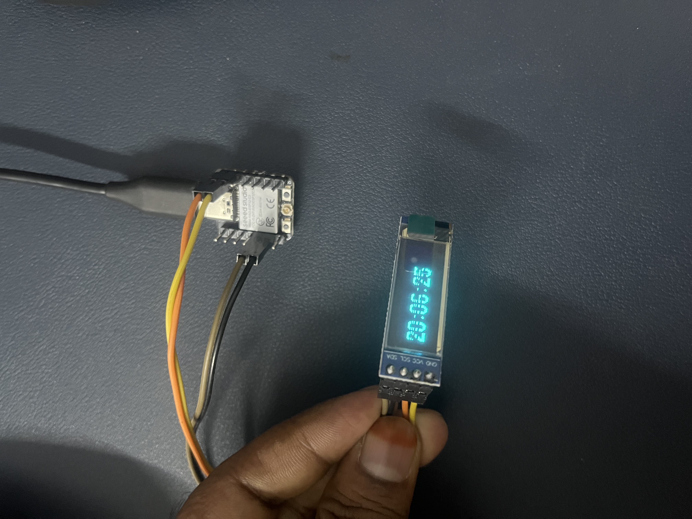

## 0.91 inch oled display with ESP32-C3

- Uses u8g2 library for driving the OLED display
- NTPClient and WIFIUdp for connecting to Wifi and fetching time
- Rename Config.h.sample to Config.h with your actual WIFI creds

## Demo Image

## References
1. https://circuitdigest.com/microcontroller-projects/esp32-internet-clock
2. https://www.electronicscomp.com/0.91-inch-i2c-iic-128x32-oled-display-module
3. https://wiki.seeedstudio.com/XIAO_ESP32C3_Pin_Multiplexing/
4. https://zenn.dev/technicarium/articles/89a25c22410219